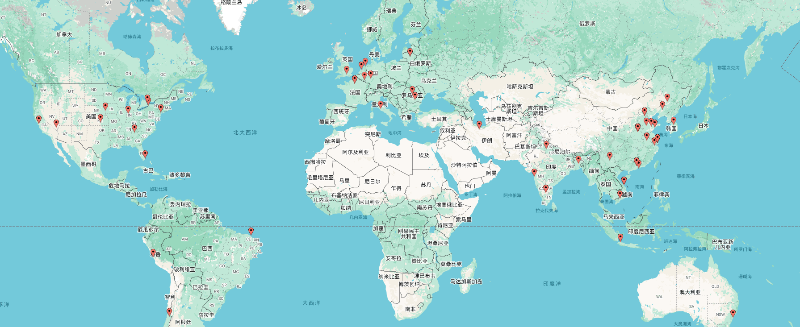

# 记一次服务器投毒

## 背景

> 收到阿里云的邮件：您的云服务器(`*.*.*.*`)由于被检测到对外攻击，已阻断该服务器对其它服务器端口（TCP:22）的访问，阻断预计将在2025-03-11 09:40:28时间内结束，请及时进行安全自查。若有疑问，请工单或电话联系阿里云售后，感谢您对阿里云的支持。

## 先问Claude排查流程

```shell
看起来您的阿里云服务器被检测到有可能对外发起攻击，特别是针对其他服务器的SSH端口(TCP:22)，因此阿里云暂时阻断了该功能。这种情况可能是服务器被入侵或者存在恶意程序导致的。以下是排查步骤：
安全排查步骤

检查登录情况和可疑账户
bashCopylast       # 查看最近登录记录
lastb      # 查看登录失败记录
who        # 查看当前登录用户
cat /etc/passwd | grep -E '(bash|sh)'   # 检查系统用户

检查可疑进程和连接
bashCopyps aux | grep -i ssh     # 查看SSH相关进程
netstat -antlp | grep 22  # 查看与22端口相关的连接
netstat -antup | grep ESTABLISHED  # 查看已建立的连接
lsof -i                  # 查看所有开放的端口

检查定时任务和自启动项
bashCopycrontab -l               # 查看当前用户的定时任务
cat /etc/crontab         # 查看系统定时任务
ls -la /etc/cron.*       # 查看系统定时任务目录
systemctl list-unit-files | grep enabled  # 查看已启用的服务

检查系统日志
bashCopygrep "Failed password" /var/log/auth.log    # 或 /var/log/secure 
grep "Accepted" /var/log/auth.log           # 查看成功登录
grep "sshd" /var/log/auth.log               # 查看SSH相关日志

检查可疑文件和后门
bashCopyfind /tmp -type f -mtime -7   # 查看近7天内/tmp目录下新增的文件
find / -perm -4000 -type f    # 查找具有SUID权限的文件
find / -name "*.sh" -mtime -7 # 查找近7天内新增的shell脚本

检查SSH配置文件
bashCopycat /etc/ssh/sshd_config    # 检查SSH配置是否被篡改

运行杀毒软件扫描
bashCopy# 安装ClamAV
apt-get install clamav clamav-daemon   # Debian/Ubuntu
# 或
yum install clamav clamav-server       # CentOS/RHEL

# 更新病毒库并扫描
freshclam
clamscan -r /   # 扫描整个系统


修复建议

更改所有密码

修改root和所有用户的密码
使用强密码策略


加固SSH配置
Copy# 编辑 /etc/ssh/sshd_config
PermitRootLogin no          # 禁止root直接登录
PasswordAuthentication no   # 禁用密码认证，使用密钥认证
MaxAuthTries 3              # 最大尝试次数
AllowUsers user1 user2      # 只允许特定用户SSH登录

安装安全工具

安装防火墙(如ufw或firewalld)并配置规则
安装fail2ban防止暴力破解
考虑使用入侵检测系统(IDS)如OSSEC


删除可疑文件和账户

删除未知或可疑的账户
删除恶意脚本和程序


更新系统
bashCopyapt update && apt upgrade   # Debian/Ubuntu
# 或
yum update                  # CentOS/RHEL


排查完成后，建议联系阿里云客服说明情况，可能有助于提前解除封禁。如果您不确定如何处理某些问题，建议寻求专业安全人员的帮助。
```

执行以上命令发现

```shell
root@iZuf62chqa405gp4uatyniZ:~# last
wtmp begins Wed Mar 12 17:13:56 2025
root@iZuf62chqa405gp4uatyniZ:~# cat /etc/passwd | grep -E '(bash|sh)'
root:x:0:0:root:/root:/bin/bash
sshd:x:105:65534::/run/sshd:/usr/sbin/nologin
ollama:x:998:998::/usr/share/ollama:/bin/false
root@iZuf62chqa405gp4uatyniZ:~# ps aux | grep -i ssh
root        1464  0.0  0.1  13352  3200 ?        Ss    2024   0:50 sshd: /usr/sbin/sshd -D [listener] 0 of 10-100 startups
root     3219795  0.0  0.4  14860  8568 ?        Ss   17:08   0:00 sshd: root@pts/0
root     3221473  0.0  0.0   6372   644 pts/1    S+   17:14   0:00 grep -i ssh
root@iZuf62chqa405gp4uatyniZ:~# netstat -antlp | grep 22
tcp        0      0 0.0.0.0:22              0.0.0.0:*               LISTEN      1464/sshd: /usr/sbi
tcp        0      1 *.*.*.*:55336       116.245.197.34:22       SYN_SENT    3044731/networkxm
tcp        0      1 *.*.*.*:48558       58.35.243.210:22        SYN_SENT    3044731/networkxm
tcp        0      1 *.*.*.*:38744       116.77.215.10:22        SYN_SENT    3044731/networkxm
tcp        0      1 *.*.*.*:42730       61.129.176.202:22       SYN_SENT    3044731/networkxm
tcp        0      1 *.*.*.*:50858       116.77.106.38:22        SYN_SENT    3044731/networkxm
tcp        0      1 *.*.*.*:42380       123.57.124.218:22       SYN_SENT    3044731/networkxm
tcp        0      1 *.*.*.*:51758       61.128.201.122:22       SYN_SENT    3044731/networkxm
tcp        0      1 *.*.*.*:37636       101.50.15.37:22         SYN_SENT    3044731/networkxm
tcp        0      1 *.*.*.*:52594       116.77.219.173:22       SYN_SENT    3044731/networkxm
tcp        0      1 *.*.*.*:46830       123.185.15.53:22        SYN_SENT    3044731/networkxm
tcp        0      1 *.*.*.*:59296       123.184.60.20:22        SYN_SENT    3044731/networkxm
tcp        0      1 *.*.*.*:56612       125.97.178.5:22         SYN_SENT    3044731/networkxm
tcp        0      1 *.*.*.*:45558       180.202.186.153:22      SYN_SENT    3044731/networkxm
tcp        0      1 *.*.*.*:57208       123.184.237.200:22      SYN_SENT    3044731/networkxm
tcp        0      1 *.*.*.*:40982       210.29.34.87:22         SYN_SENT    3044731/networkxm
tcp        0      1 *.*.*.*:47490       116.245.180.187:22      SYN_SENT    3044731/networkxm
tcp        0      1 *.*.*.*:42836       116.77.179.53:22        SYN_SENT    3044731/networkxm
...
root@iZuf62chqa405gp4uatyniZ:~# find /etc/init.d/ /etc/init/ /etc/systemd/ -type f -mtime -30
/etc/systemd/system/networkxm.service
/etc/system/system/ddaemon.service
root@iZuf62chqa405gp4uatyniZ:~# crontab -l
* * * ** /dev/shm/.bin/update >/dev/null 2>&1
```

## 分析

### 定时任务

Update文件内容

```shell
root@iZuf62chqa405gp4uatyniZ:/dev/shm/.bin# cat update
#!/bin/sh
if test -r /dev/shm/.bin/mech.pid; then
pid=$(cat /dev/shm/.bin/mech.pid)
if $(kill -CHLD $pid >/dev/null 2>&1)
then
exit 0
fi
fi
cd /dev/shm/.bin
./run &>/dev/null
```

查看/dev/shm/.bin发现一些配置信息

```shell
root@iZuf62chqa405gp4uatyniZ:/dev/shm/.bin# cat cfg
SERVER zorro.us.ix.undernet.org 6667
SERVER Bucharest.RO.EU.Undernet.Org 6667
SERVER chicago.il.us.undernet.org 6667
ADMIN luLQ0Y_p6NfU1KLW0tbU4M_Z6aDR09s=
ADMIN ptfi4qfm3tfQxaLW19fh4Y_p49bH0-LG2KDe4Mg=
ADMIN p9rQsI_p6NfU1KLW0tbU4M_Z6aDR09s=
ADMIN zdacpJisqKKaj93Nz97U54_d59XFzePWyKDS3c4=
######## bot 1 ########
IDENT smart
REALNAME 2pac;)
NICKNAMES dani daniel Sergiu juice bad
CHANNEL h9Xe0NPV4OHQtJTJyqbX1MmoqNjK
CMDCHAR @
######## bot 2 ########
IDENT Gemeni
REALNAME Gemeni
NICKNAMES Nothing Floriano
CHANNEL h9bh3c_VldvXw9nUxw==
CHANNEL h9Te4tDn1uDL
CHANNEL h9XQ2sLm1uXL
CHANNEL h7_U1sbY3uDWyg==
CHANNEL h9jU4sY=
CHANNEL h8LYz9Xm1p-wxtXO2A==
AUTOLOGIN refb18Lild_Q0M2snafe
CMDCHAR @
```

## SSH扫描攻击程序

定位程序

```shell
root@iZuf62chqa405gp4uatyniZ:~# ps -fp 3222951
UID          PID    PPID  C STIME TTY          TIME CMD
root     3222951 3044727  0 17:21 ?        00:00:00 /usr/src/bao/networkxm thread
```

文件夹下仅有这一个文件，内部是乱码

## 清理

```shell
# 清理定时任务
crontab -r

# 禁用恶意服务
systemctl stop networkxm.service
systemctl disable networkxm.service
systemctl stop ddaemon.service  
systemctl disable ddaemon.service

# 再次尝试终止
pkill -9 -f networkxm

# 删除服务文件
rm /etc/systemd/system/networkxm.service
rm /etc/systemd/system/ddaemon.service

# 重新加载systemd配置
systemctl daemon-reload
```

清理后并重置服务器密码

## 总结

猜测病毒一共分为两个文件，一个是定时任务用来启动的，一个是病毒本身用来SSH遍历攻击

过滤**/var/log/auth.log**有一千多次登录失败的记录，IP地址去除重复放地图上看了下，哪里都有～


